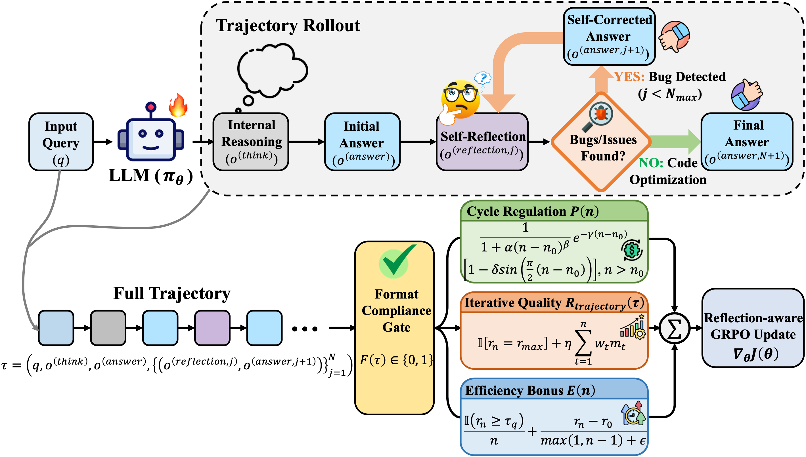

# ReflexiCoder: Teaching Large Language Models to Self-Reflect on Generated Code and Self-Correct It via Reinforcement Learning

<p align="center" width="100%">
  
</p>

## Installation

> [!CAUTION]
> This project requires **CUDA 12.4**. If you encounter segmentation faults, please verify your CUDA toolchain via `nvcc --version`.

### 1) Set up the TRL environment

```bash
conda create -n reflexicoder python=3.11
conda activate reflexicoder

pip install --upgrade pip
pip install vllm==0.8.5.post1
pip install setuptools
pip install flash-attn --no-build-isolation
pip install tensorboard

GIT_LFS_SKIP_SMUDGE=1 pip install -e ".[dev]"
pip install selenium==4.15.2
pip install pillow==10.3.0
```

This installation will also install **PyTorch v2.6.0**. This version is **required**, as the provided vLLM binaries are built against it.

Authenticate to Hugging Face and Weights & Biases (optional but recommended):

```bash
huggingface-cli login  # Required for pushing datasets/models to the HF Hub
wandb login            # Enables experiment tracking during training

sudo apt-get install git-lfs
git-lfs --version
```

### 2) Install the Firejail sandbox

Firejail is an open-source Linux sandbox that isolates processes via namespaces and seccomp, reducing security risk when executing untrusted code.

```bash
git clone https://github.com/netblue30/firejail.git

cd firejail
chmod +x configure
./configure
find . -name "*.sh" -exec chmod +x {} \;
make
sudo make install
```

## Data Preparation

For dataset download and preprocessing, please follow the **Data** section in the [DeepCoder](https://github.com/agentica-project/rllm/tree/deepcoder) guideline.  
To avoid redundant preprocessing, we provide the preprocessed `parquet` files under `./data`, which can be used directly for training.

## Training

```bash
GIT_LFS_SKIP_SMUDGE=1 pip install -e ".[dev]"

export TOKENIZERS_PARALLELISM=false
export TIMESTAMP=$(date +"%m-%d-%y-%T")
export CONFIG_GRPO="configs/reflexicoder/config_grpo.yaml" 
export MODEL_NAME_OR_PATH="/path_to_your_model/Qwen3-8B"
export DATASET_NAME="./data"
export OUTPUT_DIR="./output/$TIMESTAMP"
export ROLLOUT_FILE="$OUTPUT_DIR"
export LOG_FILE="$OUTPUT_DIR/training.log"

mkdir -p $OUTPUT_DIR

ACCELERATE_LOG_LEVEL=info \
    accelerate launch --config_file configs/accelerate_configs/zero2.yaml \
    src/open_r1/grpo.py --config $CONFIG_GRPO \
    --model_name_or_path $MODEL_NAME_OR_PATH \
    --dataset_name $DATASET_NAME \
    --output_dir $OUTPUT_DIR \
    --vllm_mode colocate 2>&1 | tee $LOG_FILE
```

## Evaluation

We evaluate all baselines and RL-trained models on **HumanEval**, **HumanEval+**, **MBPP**, **MBPP+**, **LiveCodeBench_v5**, and **CodeForces** using the **EvalChemy** framework to ensure consistent evaluation.

For the full evaluation pipeline, please refer to the official [EvalChemy](https://github.com/mlfoundations/evalchemy) and its README.
